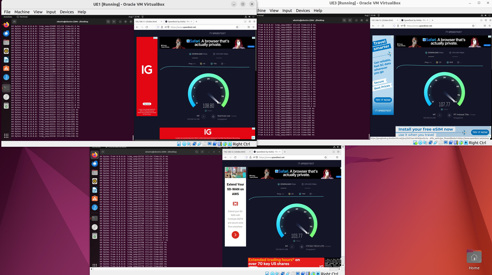
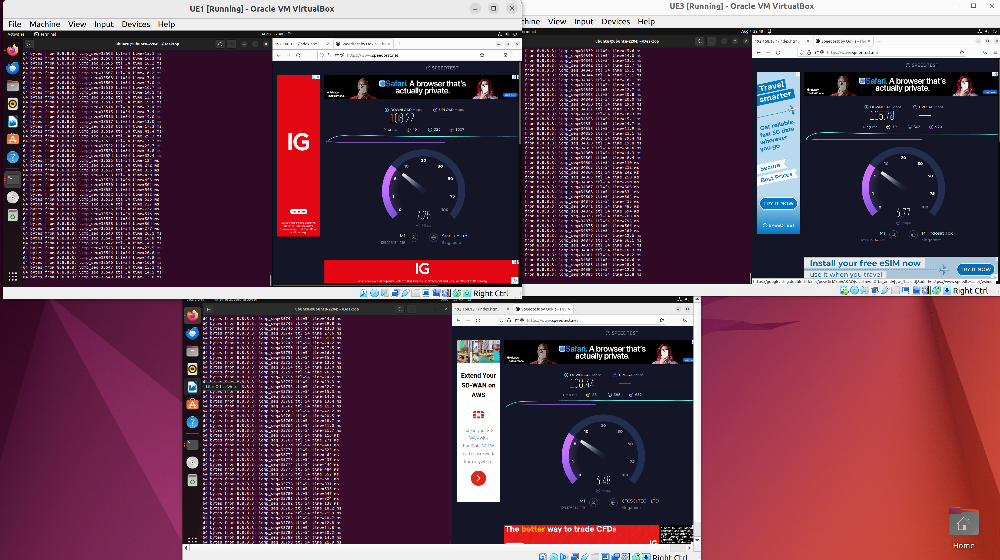
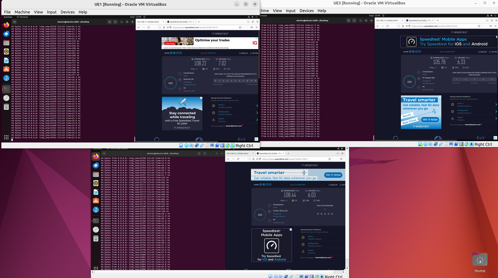
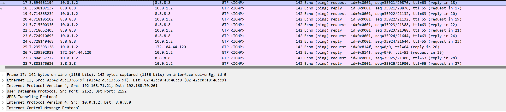
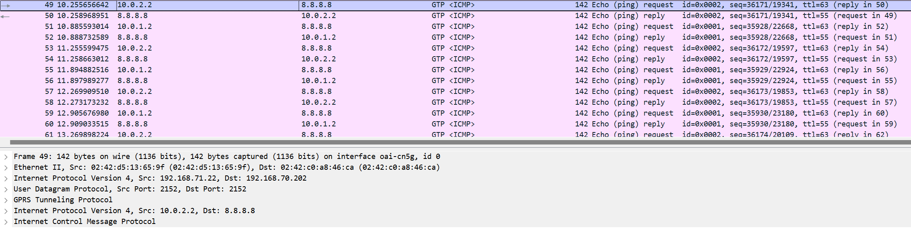
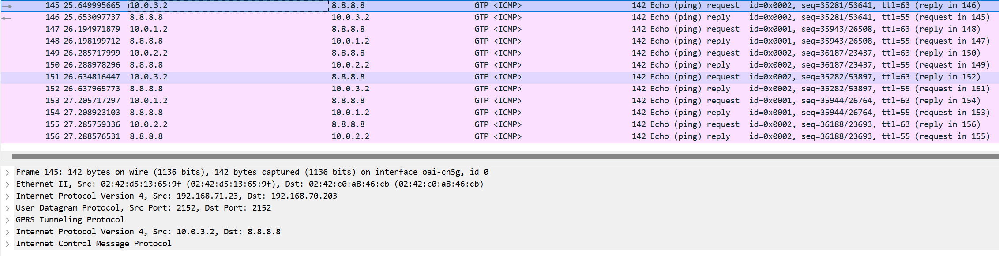

# 5G Deployment Guide


## 5G Core

#### Patch AMF with hardcoded Configured Slice for UEs
```
cd ~/oai-cn5g-fed/component/oai-amf
git checkout -f 21e6395b1f353e6cdd41f413e215daeb85732a26
git apply ~/openairinterface5g/oai-conf/patch/amf.patch
docker build -t oai-amf-hardcoded-configured-slice -f docker/Dockerfile.amf.ubuntu  .
```
With this patch:
* UE `001010000000001` associate with slice `stt=1` `sd=000001` `DNN=oai1` 
* UE `001010000000002` associate with slice `stt=2` `sd=000002` `DNN=oai2` 
* UE `001010000000003` associate with slice `stt=3` `sd=000003` `DNN=oai3` 

#### Deploy oai-cn5g WITHOUT network slicing feature at 5G Core (5GC) network
```
cd ~/openairinterface5g/oai-conf/oai-cn5g
docker compose up -d
```

#### Deploy oai-cn5g WITH network slicing  feature at 5G Core (5GC) network
```
cd ~/openairinterface5g/oai-conf/oai-cn5g-slice
docker compose -f docker-compose-slicing-basic-nrf.yaml up -d
```

## gNB
### Monolithic gNB

* Build nr-softmodem
```
cd ~/openairinterface5g/cmake_targets
./build_oai -w USRP --gNB --build-e2 --ninja
```
* Run nr-softmodem
```
sudo ifconfig ens1f0 192.168.10.1/24
sudo ifconfig ens1f0 mtu 9000
cd ~/openairinterface5g/cmake_targets/ran_build/build
sudo ./nr-softmodem -O  ../../../oai-conf/oai-ran/gnb.sa.band78.fr1.106PRB.2x2.usrpx410.352501.conf --sa
```

### Splited gNB + Netowork Slicing: CU-CP CU-UP DU

* Build docker images
```
cd ~/openairinterface5g
docker build -t ran-base:ubuntu22 -f docker/Dockerfile.base.ubuntu22 .
docker build -t ran-build:ubuntu22 -f docker/Dockerfile.build.ubuntu22 .
docker build -t ran-build-flexric:ubuntu22 -f docker/Dockerfile.build.flexric.ubuntu22 .

docker build -t oai-nr-softmodem:ubuntu22 -f docker/Dockerfile.gNB.ubuntu22 .
docker build -t oai-nr-cuup:ubuntu22 -f docker/Dockerfile.nr-cuup.ubuntu22 .
docker build -t oai-nr-flexric:ubuntu22 -f docker/Dockerfile.flexric.ubuntu22 .
```

* Allow routing between subnets
````
sudo echo 1 > /proc/sys/net/ipv4/ip_forward

sudo iptables -D DOCKER-ISOLATION-STAGE-1 -i oai-cn5g ! -o oai-cn5g -j DOCKER-ISOLATION-STAGE-2
sudo iptables -D DOCKER-ISOLATION-STAGE-1 -i oai-cu-cp-up-du ! -o oai-cu-cp-up-du -j DOCKER-ISOLATION-STAGE-2

sudo iptables -t nat -D POSTROUTING -s 192.168.70.0/24 ! -o oai-cn5g -j MASQUERADE
sudo iptables -t nat -D POSTROUTING -s 192.168.71.0/24 ! -o oai-cu-cp-up-du -j MASQUERADE
````

* Deploy CU-CP CU-UP DU
```
cd ~/openairinterface5g/oai-conf/oai-ran
docker compose up -d
```

# Results

* UEs throughput

<div style="display: flex; justify-content: center;">
  
  
  
</div>

* Pcap file
```
oai-conf/docs/pcap/ngap_icmp_3_slices.pcapng
```






# Notes

### UHD_VERSION
* May need to change UHD_VERSION in Dockerfile.base and build again
```
sysctl: cannot stat /proc/sys/net/core/rmem_max: No such file or directory
sysctl: cannot stat /proc/sys/net/core/wmem_max: No such file or directory
[HW]   Can't set kernel parameters for X4x0
[INFO] [MPMD] Initializing 1 device(s) in parallel with args: mgmt_addr=192.168.10.2,type=x4xx,product=x410,serial=32DAFAA,name=ni-x4xx-32DAFAA,fpga=X4_200,claimed=False,addr=192.168.10.2,clock_source=internal,time_source=internal,master_clock_rate=245760000.000000
[WARNING] [MPM.RPCServer] A timeout event occured!
[ERROR] [MPMD] MPM major compat number mismatch. Expected: 4.4 Actual: 5.3. Please update the version of MPM on your USRP device.
terminate called after throwing an instance of 'uhd::runtime_error'
  what():  RuntimeError: MPM major compat number mismatch. Expected: 4.4 Actual: 5.3. Please update the version of MPM on your USRP device.
[INFO  tini (1)] Main child exited with signal (with signal 'Aborted')
```

* Show UDH images
```
uhd_images_downloader -l
```


### Run Splited gNB without docker
* Congigure IP
```
sudo ip address add 192.168.71.10/24 dev lo
sudo ip address add 192.168.71.21/24 dev lo
sudo ip address add 192.168.71.22/24 dev lo
sudo ip address add 192.168.71.23/24 dev lo
sudo ip address add 192.168.71.30/24 dev lo
```

* CU-CP
```
sudo ./nr-softmodem -O ../../../oai-conf/oai-ran/gnb-cucp.sa.f1.conf --sa
```

* 3 CU-UPs
```
sudo ./nr-cuup -O ../../../oai-conf/oai-ran/gnb-cuup.sa.f1.slice1.conf --sa
sudo ./nr-cuup -O ../../../oai-conf/oai-ran/gnb-cuup.sa.f1.slice2.conf --sa
sudo ./nr-cuup -O ../../../oai-conf/oai-ran/gnb-cuup.sa.f1.slice3.conf --sa
```

* DU
```
sudo ./nr-softmodem -O ../../../oai-conf/oai-ran/gnb-du.sa.conf --sa
```

### uhd::op_timeout
```
TYPE <CTRL-C> TO TERMINATE
got sync (ru_thread)
got sync (L1_stats_thread)
[HW]   current pps at 1.000000, starting streaming at 2.000000
[PHY]   RU 0 rf device ready
[PHY]   RU 0 RF started opp_enabled 0
sleep...
sleep...
sleep...
sleep...
sleep...
sleep...
sleep...
sleep...
OOterminate called after throwing an instance of 'uhd::op_timeout'
  what():  RfnocError: OpTimeout: Control operation timed out waiting for ACK
[INFO  tini (1)] Main child exited with signal (with signal 'Aborted')
[INFO  tini (1)] Spawned child process '/opt/oai-gnb/bin/entrypoint.sh' with pid '7'
```

Issue these comands in the host OS (outside container)
```
sudo sysctl -w net.core.wmem_max=62500000
sudo sysctl -w net.core.rmem_max=62500000
sudo sysctl -w net.core.wmem_default=62500000
sudo sysctl -w net.core.rmem_default=62500000
```

### Miscellanious
* Print iptables 
```
sudo iptables -S
sudo iptables -t nat -S
sudo iptables -t nat -L POSTROUTING -v -n
```
* Update submodule
```
git submodule init
git submodule update
```

* oai-cn5g-fed branch
```
fdf2970a731fe47fbda82487a9f7cebbf4af8f4d
```
