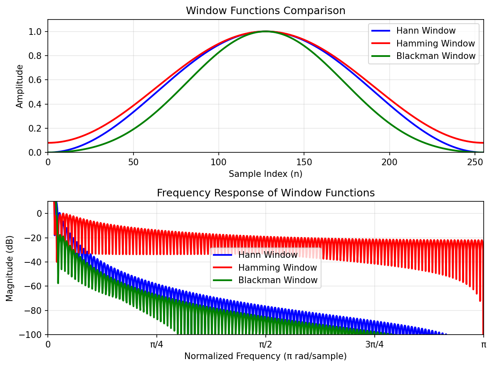

# STFT Parameters Guide

## Mathematical Foundation

### Fast Fourier Transform (FFT)

The Fast Fourier Transform (FFT) is an efficient algorithm to compute the Discrete Fourier Transform (DFT) and its inverse. It is the computational backbone of STFT analysis.

#### DFT Definition

The Discrete Fourier Transform is defined as:

```math
X[k] = \sum_{n=0}^{N-1} x[n] \cdot e^{-j2\pi kn/N}
```

&nbsp; **Where:**

&nbsp;&nbsp;&nbsp;&nbsp;• **X[k]**: Complex frequency domain representation  
&nbsp;&nbsp;&nbsp;&nbsp;• **x[n]**: Input signal in time domain  
&nbsp;&nbsp;&nbsp;&nbsp;• **N**: Number of samples (FFT Size) ⚙️ *Calculated from Sample Rate and Resolution*  
&nbsp;&nbsp;&nbsp;&nbsp;• **k**: Frequency bin index (0 to N-1)

&nbsp; **Interpretation:** Complex input signal shows both real and imaginary components in frequency domain. DC component represents average signal power, while harmonics show frequency content.


&nbsp; **Example:** For N = 4, x[n] = [1+j, 2, 1-j, 0], X[0] = 4, X[1] = 2j, X[2] = 0, X[3] = -2j

&nbsp;&nbsp;&nbsp;&nbsp;• **X[0] (DC component)**: (1+j)·1 + 2·1 + (1-j)·1 + 0·1 = 4  
&nbsp;&nbsp;&nbsp;&nbsp;• **X[1] (1st harmonic)**: (1+j)·1 + 2·(-j) + (1-j)·(-1) + 0·j = 2j  
&nbsp;&nbsp;&nbsp;&nbsp;• **X[2] (2nd harmonic)**: (1+j)·1 + 2·(-1) + (1-j)·1 + 0·(-1) = 0  
&nbsp;&nbsp;&nbsp;&nbsp;• **X[3] (3rd harmonic)**: (1+j)·1 + 2·j + (1-j)·(-1) + 0·(-j) = -2j

#### FFT Properties

&nbsp; **Frequency Resolution:**
```math
\Delta f = \frac{f_s}{N}
```

&nbsp; **Example:** If f_s = 1 MHz and N = 1024, then Δf = 1,000,000 / 1024 ≈ 976.6 Hz

&nbsp; **Practical Impact:** This means you can distinguish between signals that are at least 976.6 Hz apart. For example, you could separate a 1 MHz signal from a 1.001 MHz signal.

&nbsp; **Time Resolution:**
```math
\Delta t = \frac{N}{f_s}
```

&nbsp; **Example:** If N = 1024 and f_s = 1 MHz, then Δt = 1024 / 1,000,000 = 1.024 ms

&nbsp; **Practical Impact:** Each FFT frame represents 1.024 ms of signal. This determines how quickly you can detect changes in the signal over time.

&nbsp; **Key Characteristics:**

&nbsp;&nbsp;&nbsp;&nbsp;• **Computational Complexity**: O(N log N) instead of O(N²) for direct DFT
&nbsp;&nbsp;&nbsp;&nbsp;• **Power of 2**: Most efficient when N is a power of 2
&nbsp;&nbsp;&nbsp;&nbsp;• **Symmetry**: For real input signals, only half the spectrum is unique
&nbsp;&nbsp;&nbsp;&nbsp;• **Nyquist Frequency**: Maximum frequency = f_s/2

### Discrete STFT Formula

For digital signals, the STFT is computed as:

```math
X[m, k] = \sum_{n} x[n] \cdot w[n-mH] \cdot e^{-j2\pi kn/N}
```

&nbsp; **Where:**

&nbsp;&nbsp;&nbsp;&nbsp;• **m**: Time frame index  
&nbsp;&nbsp;&nbsp;&nbsp;• **k**: Frequency bin index  
&nbsp;&nbsp;&nbsp;&nbsp;• **H**: Hop size (samples between frames)  
&nbsp;&nbsp;&nbsp;&nbsp;• **N**: FFT size  
&nbsp;&nbsp;&nbsp;&nbsp;• **w[n]**: Window function

### STFT Window Functions

Window functions are applied to reduce spectral leakage and improve time-frequency analysis:

**Hann Window:**
```math
w[n] = 0.5 \left(1 - \cos\left(\frac{2\pi n}{N-1}\right)\right)
```

&nbsp; **Example:** For N = 4, w[0] = 0, w[1] = 0.5, w[2] = 0.5, w[3] = 0

&nbsp; **Characteristics:** Smooth tapering at edges, good sidelobe suppression (-31.5 dB), moderate main lobe width. Best for general-purpose spectral analysis.

**Hamming Window:**
```math
w[n] = 0.54 - 0.46 \cos\left(\frac{2\pi n}{N-1}\right)
```

&nbsp; **Example:** For N = 4, w[0] = 0.08, w[1] = 0.54, w[2] = 0.54, w[3] = 0.08

&nbsp; **Characteristics:** Better sidelobe suppression (-43 dB) than Hann, slightly wider main lobe. Good for detecting weak signals near strong ones.

**Blackman Window:**
```math
w[n] = 0.42 - 0.5 \cos\left(\frac{2\pi n}{N-1}\right) + 0.08 \cos\left(\frac{4\pi n}{N-1}\right)
```

&nbsp; **Example:** For N = 4, w[0] = 0, w[1] = 0.34, w[2] = 0.34, w[3] = 0

&nbsp; **Characteristics:** Best sidelobe suppression (-58 dB), widest main lobe. Excellent for detecting very weak signals, but poorer frequency resolution.

**Window Functions Visualization:**



*Top: Time domain comparison of window shapes. Bottom: Frequency domain magnitude response showing sidelobe characteristics.*

## Core Parameters

### 1. Center Frequency ⚙️ *"Center Frequency" Setting*

The center frequency is the frequency around which the USRP device is tuned. This determines which part of the frequency spectrum you want to analyze.

**Examples:**
- WiFi 2.4GHz: `2.4G`
- WiFi 5GHz: `5G`
- Cellular 900MHz: `900M`
- GPS L1: `1.575G`

**Formula:**
```math
f_{center} = f_{USRP\_tuning\_frequency}
```

**Example:** If USRP is tuned to 2.4 GHz, then f_center = 2,400,000,000 Hz

**Practical Application:** This is ideal for WiFi analysis since 2.4 GHz is the standard WiFi frequency band. You'll capture signals from 2.3995 GHz to 2.4005 GHz with a 1 MHz bandwidth.

### 2. Sample Rate (Bandwidth) ⚙️ *"Sample Rate" Setting*

The sampling rate determines the bandwidth of the signal capture. Higher rates provide wider frequency coverage but require more processing power.

**Examples:**
- Audio: `44.1K` (44.1 kHz)
- RF Analysis: `1M` (1 MHz)
- Wideband: `10M` (10 MHz)
- 5G NR: `30.72M` (30.72 MHz)

**Nyquist Theorem:**
```math
f_{max} = \frac{f_{sample\_rate}}{2}
```

**Example:** If sample rate = 1 MHz, then f_max = 1,000,000 / 2 = 500 kHz

**Practical Limitation:** You cannot detect signals above 500 kHz with this sample rate. If you need to analyze higher frequencies, you must increase the sample rate to at least 2× the highest frequency of interest.

### 3. FFT Size ⚙️ *Calculated from Sample Rate and Resolution*

Number of frequency bins in the FFT. Larger FFT sizes provide better frequency resolution but require more processing time.

**Formula:**
```math
\text{Frequency Resolution} = \frac{\text{Sample Rate}}{\text{FFT Size}}
```

**Example:** If sample rate = 1 MHz and FFT size = 1024, then frequency resolution = 1,000,000 / 1024 ≈ 976.6 Hz

**Trade-off Analysis:** 

> • **Better frequency resolution**: Use larger FFT size (2048, 4096)  
> • **Faster processing**: Use smaller FFT size (512, 256)  
> • **Memory usage**: FFT size directly affects RAM requirements

```math
\text{Time Resolution} = \frac{\text{FFT Size}}{\text{Sample Rate}}
```

**Example:** If FFT size = 1024 and sample rate = 1 MHz, then time resolution = 1024 / 1,000,000 = 1.024 ms

**Real-time Considerations:** 

> • **1.024 ms frames**: Good for detecting rapid signal changes  
> • **Processing overhead**: Each frame requires computational resources  
> • **Buffer requirements**: Need sufficient memory for real-time processing

&nbsp; **Common Values:**

&nbsp;&nbsp;&nbsp;&nbsp;• 512 - Fast processing  
&nbsp;&nbsp;&nbsp;&nbsp;• 1024 - Balanced  
&nbsp;&nbsp;&nbsp;&nbsp;• 2048 - High resolution  
&nbsp;&nbsp;&nbsp;&nbsp;• 4096 - Very high resolution

&nbsp; **Constraints:**

&nbsp;&nbsp;&nbsp;&nbsp;• Must be power of 2 for FFT efficiency  
&nbsp;&nbsp;&nbsp;&nbsp;• Larger values = better frequency resolution  
&nbsp;&nbsp;&nbsp;&nbsp;• Smaller values = faster processing

### 4. Resolution (Optional) ⚙️ *"Resolution" Setting*

Desired frequency resolution in Hz. If provided, this will automatically calculate the FFT size.

**Formula:**
```math
\text{FFT Size} = \frac{\text{Sample Rate}}{\text{Resolution}}
```

&nbsp; **Example:** If sample rate = 1 MHz and desired resolution = 1 kHz, then FFT size = 1,000,000 / 1,000 = 1,024

&nbsp; **Automatic Optimization:** The system automatically rounds up to the nearest power of 2 (1024) for efficient FFT computation. This ensures optimal performance while meeting your resolution requirements.

**Examples:**
    - 1K (1 kHz resolution)
    - 100 (100 Hz resolution)
    - 500 (500 Hz resolution)

## STFT-Specific Parameters

### 5. Window Size ⚙️ *"Window Size" Setting*

Number of samples per STFT frame. If not specified, uses the FFT size.

&nbsp; **Effects:**

&nbsp;&nbsp;&nbsp;&nbsp;• **Smaller windows**: Better time resolution, faster response to signal changes, less frequency resolution

&nbsp;&nbsp;&nbsp;&nbsp;• **Larger windows**: Better frequency resolution, slower response to changes, more stable frequency measurements

&nbsp; **Typical values:**

&nbsp;&nbsp;&nbsp;&nbsp;• 64 to 8192 samples

&nbsp;&nbsp;&nbsp;&nbsp;• Must be ≤ FFT Size

&nbsp;&nbsp;&nbsp;&nbsp;• Usually power of 2 for efficiency

### 6. Hop Size ⚙️ *"Hop Size" Setting*

Number of samples to advance between consecutive STFT frames.

**Default:** `window_size / 2` (50% overlap)

**Effects:**
- **Smaller hop sizes**: Smoother time resolution, more overlapping frames, higher computational overhead, better time-domain detail
- **Larger hop sizes**: Faster processing, less overlap between frames, lower computational cost, coarser time resolution

**Overlap Calculation:**
```math
\text{Overlap} = \text{Window Size} - \text{Hop Size}
```

**Example:** If window size = 1024 and hop size = 512, then overlap = 1024 - 512 = 512 samples

&nbsp; **Overlap Benefits:**

&nbsp;&nbsp;&nbsp;&nbsp;• **Smoother transitions**: Reduces artifacts between frames

&nbsp;&nbsp;&nbsp;&nbsp;• **Better time resolution**: More frequent updates of the spectrum

&nbsp;&nbsp;&nbsp;&nbsp;• **Reduced spectral leakage**: Better frequency domain representation

```math
\text{Typical overlap: } 50\% \text{ (hop = window/2)}
```

&nbsp; **Example:** If window size = 1024, then typical hop size = 1024 / 2 = 512 samples (50% overlap)

&nbsp; **Overlap Guidelines:**

&nbsp;&nbsp;&nbsp;&nbsp;• **25% overlap**: Fast processing, coarse time resolution

&nbsp;&nbsp;&nbsp;&nbsp;• **50% overlap**: Balanced performance (recommended)

&nbsp;&nbsp;&nbsp;&nbsp;• **75% overlap**: High quality, slower processing

&nbsp;&nbsp;&nbsp;&nbsp;• **100% overlap**: Maximum quality, maximum computational cost

### 7. Window Type ⚙️ *"Window Type" Setting*

Type of window function applied to the signal before FFT.

**Types:**
- **Hann (Hanning)**: Most commonly used, good balance of main lobe width and sidelobe suppression, recommended for general use
- **Hamming**: Better sidelobe suppression than Hann, slightly wider main lobe, good for frequency analysis
- **Blackman**: Best sidelobe suppression, widest main lobe, best for detecting weak signals
- **Rectangular**: No windowing applied, sharpest main lobe, poor sidelobe suppression, can cause spectral leakage

## Display Parameters

### 8. Colormap ⚙️ *"Colormap" Setting*

Color scheme used to display signal amplitude.

**Types:**
- **Viridis**: Default choice, good for colorblind users, perceptually uniform, blue to yellow progression
- **Plasma**: Purple to yellow, high contrast, good for detailed analysis
- **Inferno**: Black to yellow, high contrast, good for weak signals
- **Magma**: Black to pink, smooth transitions, good for general use
- **Cool**: Cyan to magenta, good for temperature-like data
- **Hot**: Black to white, classic heat map, high contrast

### 9. Gain (dB) ⚙️ *"Gain" Setting*

Receiver gain in decibels.

**Effects:**
- **Higher gain**: Amplifies weak signals, improves signal detection, may cause saturation with strong signals, increases noise floor
- **Lower gain**: Reduces signal strength, prevents saturation, lower noise floor, may miss weak signals

**Typical ranges:**
- USRP B200: 0-60 dB
- USRP X300/X310: 0-60 dB
- USRP N200/N210: 0-60 dB

**Recommendation:** Start with 20-30 dB and adjust based on signal strength.

## Best Practices

### Parameter Selection Guidelines

1. **Start with Hann window** for general use
2. **Use 50% overlap** (hop = window/2) for smooth time resolution
3. **FFT size should be ≥ window size** for optimal performance
4. **Higher sample rate = wider bandwidth** coverage
5. **Adjust gain to avoid saturation** while maintaining signal visibility

### Time-Frequency Resolution Trade-off

**For Better Time Resolution:**
- Smaller window size
- Smaller hop size
- Smaller FFT size

**For Better Frequency Resolution:**
- Larger window size
- Larger FFT size
- Larger hop size (but this reduces time resolution)

### Computational Considerations

**Processing Time:**
```math
\text{Processing Time} \propto (\text{Number of frames}) \times (\text{FFT size})
```
```math
\text{Number of frames} = \frac{\text{Signal length} - \text{Window size}}{\text{Hop size}}
```

**Memory Usage:**
```math
\text{Memory Usage} \propto (\text{Number of frames}) \times (\text{FFT size})
```
```math
\text{Consider real-time constraints}
```

### Example Configurations

**Audio Analysis:**
- Sample Rate: 44.1K
- FFT Size: 1024
- Window: Hann
- Hop: 512 (50% overlap)

**RF Signal Analysis:**
- Sample Rate: 1M
- FFT Size: 2048
- Window: Hamming
- Hop: 1024 (50% overlap)

**Wideband Analysis:**
- Sample Rate: 10M
- FFT Size: 4096
- Window: Blackman
- Hop: 2048 (50% overlap)


## Troubleshooting

### Common Issues

1. **Poor Frequency Resolution**: Increase FFT size or window size
2. **Poor Time Resolution**: Decrease window size or hop size
3. **Signal Saturation**: Reduce gain
4. **Weak Signal Detection**: Increase gain or use Blackman window
5. **Slow Processing**: Reduce FFT size or increase hop size

### Performance Optimization

1. **Use power-of-2 FFT sizes** for efficient computation
2. **Balance overlap** between time and frequency resolution
3. **Choose appropriate window** for your signal type
4. **Monitor CPU usage** and adjust parameters accordingly
